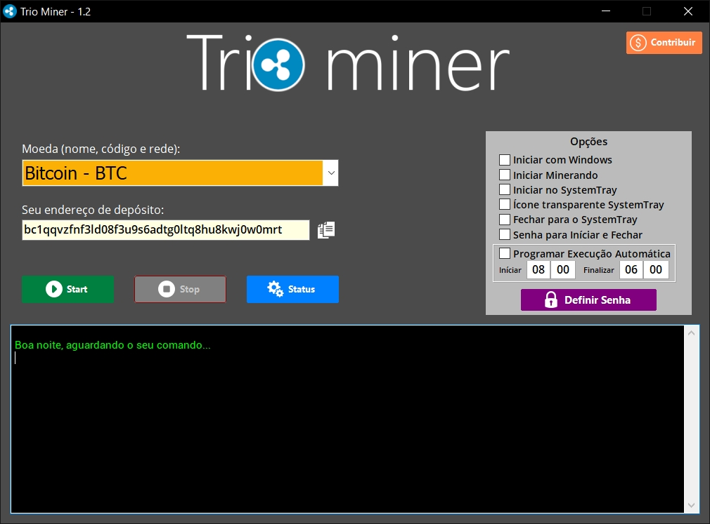

# TrioMiner

Trio miner has a high performance to mine on INTEL or AMD CPU’s and can work silently and hidden.

# Is the Trio miner a trojan?
 
Trio miner use XMRig to mine. it is a legitimate crypto miner used by hundreds of users. In some cases, however, various viruses use its name to hide itself in the system. xmlrig.exe is legitimate.
XMRig is a coin mining tool, which is officially developed and distributed by the eponymous user. The current actual version of this program is 6.12.1, released on April 24, 2021. It allows you to use CPU computing power to conduct a cryptocurrency mining operation. The block hash computation (which usually means in cryptocurrency mining) takes a lot of time, and this time can be reduced by increasing the hardware's power. People who are involved in cryptography mining use the XMRig program to control this process through various settings. You can choose between mining kernels that differ in resource consumption and make various adjustments to increase the efficiency of the mining process on your computer. This program is definitely benevolent and legitimate, and you have nothing to worry about.

To use it you will have to put an exception or disable your antivirus while using Trio miner.

## Mining backends
- **CPU** (x64/ARMv8)
- **OpenCL** for AMD GPUs.

## Download
* **[Binary releases](https://github.com/triominer/triominer)**

## Usage

Simple interface and with support for over 50 coins, CPU mining offers the opportunity of mining for those who do not have a high-performance GPU equipment.
Trio miner settings are quite simple and provide privacy for those who want to mine coins in the background. You can even configure mining times and password to lock the application.

## Donations
* BTC: `bc1qqvzfnf3ld08f3u9s6adtg0ltq8hu8kwj0w0mrt`

## Contacts
* ailtonmatos.1984@gmail.com

